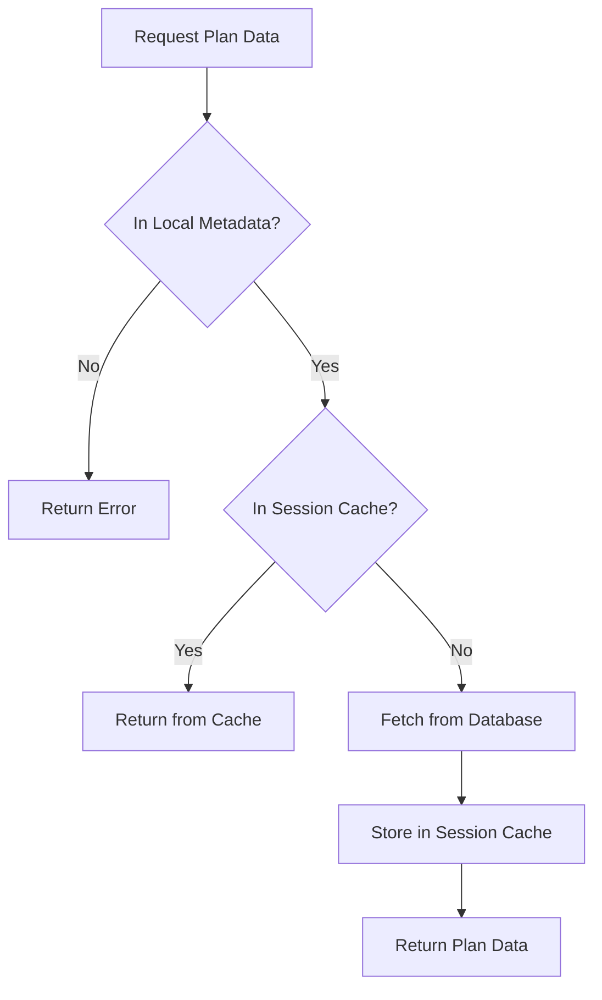
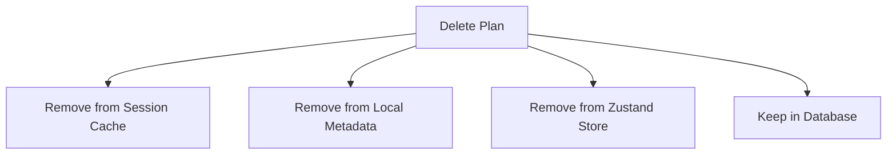

# Plan Data Storage and Caching System

This document explains how the training plan data storage and caching system works in T-JSON.

## Overview

The application uses a multi-layered approach to store and retrieve training plan data:

1. **Supabase Database**: The primary persistent storage for all plan data
2. **Zustand Store with LocalStorage Persistence**: Stores plan metadata for quick access across sessions
3. **Session Memory Cache**: Temporarily caches full plan data during the current browser session

This approach balances performance and storage efficiency while ensuring plans are never lost.

## Storage Layers Explained

### 1. Supabase Database

- The database is the source of truth for all plan data
- Plans are never deleted from the database, even when users "delete" them locally
- Each plan has both metadata (name, creation date, etc.) and full plan data (weeks, exercises, etc.)
- The database is queried only when necessary to minimize loading times

### 2. Zustand Store with LocalStorage Persistence

- Uses Zustand's `persist` middleware to save plan metadata in the browser's localStorage
- Only stores lightweight metadata (id, name, dates) to avoid storage limits
- Provides quick access to the user's plan list without database queries
- Persists across browser sessions and refreshes
- Located in `store/plan-store.ts`

### 3. Session Memory Cache

- Implemented in `store/session-cache.ts`
- Caches full plan data in browser memory during the current session
- Provides extremely fast access to recently viewed plans
- Automatically expires cache entries after 30 minutes
- Cleared when the browser tab is closed or refreshed

## Data Flow

### Loading a Plan

1. Check if the plan exists in the local metadata list
   - If not, return error (we don't show plans not in the user's list)
2. Check if the plan exists in the session cache
   - If found, return immediately (fastest path)
3. Fetch the plan from the database
   - Store it in the session cache for future access
   - Return the plan data

### "Deleting" a Plan

When a user deletes a plan:

1. The plan remains in the database (never deleted)
2. The plan metadata is removed from localStorage
3. The plan is removed from the session cache
4. The plan is removed from the Zustand store state

### Handling Admin Deletions

If an administrator deletes a plan from the database:

1. When a user tries to access that plan, the app detects it's missing from the database
2. The plan is automatically removed from the user's local metadata list
3. The user is notified that the plan no longer exists
4. This keeps the local state in sync with the database

## Storage Components

### Zustand Store (`store/plan-store.ts`)

The Zustand store manages the application state including:

- Plan metadata list
- Active plan data
- Loading states
- Error handling

Key functions:
- `fetchPlanById`: Retrieves plan data using the caching strategy
- `fetchPlanMetadata`: Gets metadata for plans in the user's list
- `removeLocalPlan`: Removes a plan from local storage and cache
- `loadPlanAndSetMode`: Loads a plan and sets the appropriate viewing/editing mode

### Session Cache (`store/session-cache.ts`)

A lightweight in-memory caching system that:

- Stores plan data with time-based expiration
- Provides helper functions for plan-specific operations
- Automatically removes stale data
- Improves performance by avoiding database queries

Key functions:
- `getPlanFromCache`: Get a plan from the cache
- `cachePlan`: Store a plan in the cache
- `removePlanFromCache`: Remove a plan from the cache
- `hasPlanInCache`: Check if a plan exists in the cache

## Configuration Options

The session cache has configurable options:

- **Cache Entry Lifetime**: Default is 30 minutes, configurable when creating the cache
- **Cache Key Format**: Plans are stored with the key format `plan_${planId}`

## Performance Considerations

- The app loads quickly because it doesn't fetch full plan data on startup
- Recently viewed plans load instantly from the session cache
- Plans are only fetched from the database when viewed for the first time in a session
- This approach scales well even with many plans in a user's collection

## Limitations

- Session cache is cleared when the browser tab is closed or refreshed
- If an admin updates a plan in the database, users will only see the changes after their cache expires
- Large plans could potentially use significant memory, but the expiration helps mitigate this

## Future Improvements

Potential improvements could include:

- Adding a cache invalidation mechanism for admins to push updates
- Implementing a more sophisticated cache entry eviction policy
- Adding offline capabilities with Service Workers
